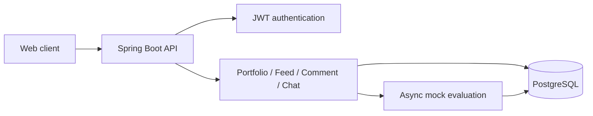

# PORI

**포트폴리오를 공유하고, 피드백을 주고받으며 성장하는 플랫폼**

`Java 17` · `Spring Boot 3.3.5` · `PostgreSQL` · `JWT` · `Docker` · `GCP Cloud Run`

[코드 안내](#코드-둘러보기) · [로컬 실행](#로컬-실행) · [개발 계획](docs/ROADMAP.md) · [원본과 이력](docs/PROVENANCE.md)

GDGoC AJOU × INHA 연합해커톤 「Build with AI」 **팀 대상** 수상 프로젝트입니다. 정인아는 팀장과 백엔드 단독 개발을 맡았습니다. 이 저장소는 팀 원본의 커밋 이력을 유지한 **개인 후속 개발본**입니다.

## 핵심 기능

| 영역 | 구현 내용 |
| --- | --- |
| 인증·프로필 | 회원가입, 로그인, JWT 갱신, 프로필 수정·탈퇴 |
| 포트폴리오 | 등록·조회·수정·삭제, 비동기 평가 흐름, 버전 재배포 |
| 커뮤니티 | 점수 기반 익명 피드, 댓글·신고, 1:1 메시지 |
| 공통 | 입력 검증, 예외·응답 형식, Swagger, 헬스체크 |

> **현재 코드의 평가 방식:** `AiPipelineService`는 `mockScore()`와 템플릿으로 점수·피드백을 만드는 모의 평가입니다. 실제 LLM API 호출은 이 백엔드에 포함되어 있지 않습니다. 서비스 기획상의 AI 평가와 현재 구현을 구분합니다.

## 담당 경험

- 명세 기반 개발과 AI 도구를 활용해 6시간 내 1차 MVP를 완성하고, 생성 코드를 직접 검토하며 기능별 E2E 동작을 확인했습니다.
- 컨테이너 반복 종료, 유휴 DB 연결, 첫 요청 실패를 각각 분석하며 JVM 메모리 정책과 배포 설정을 다뤘습니다.
- 점수화·랭킹을 활용한 게임화 방향을 제안하고 팀과 기획·UX를 논의했습니다.

`Dockerfile`에는 `MaxRAMPercentage=75.0`과 G1GC 설정이 있으며, 기존 Cloud Run 배포 기록은 [팀 배포 설정](docs/upstream-workflows/deploy.yml)에 보존했습니다. 당시 운영 경험과 현재 코드 점검에서 발견한 개선 항목은 [개발 계획](docs/ROADMAP.md)에서 구분합니다.

## 코드 둘러보기

| 관심사 | 시작점 |
| --- | --- |
| 인증·토큰 | [auth](src/main/java/com/pori/auth) · [JWT](src/main/java/com/pori/global/jwt) |
| 평가·발행 흐름 | [PortfolioService](src/main/java/com/pori/portfolio/service/PortfolioService.java) · [AiPipelineService](src/main/java/com/pori/portfolio/service/AiPipelineService.java) |
| 피드·댓글·메시지 | [feed](src/main/java/com/pori/feed) · [comment](src/main/java/com/pori/comment) · [chat](src/main/java/com/pori/chat) |
| 테스트 | [src/test](src/test) |
| API 목록 | [구현 현황](docs/IMPLEMENTATION_STATUS.md) · [컨트롤러 소스](src/main/java/com/pori) |



## 로컬 실행

JDK 17과 Docker Compose가 필요합니다. 현재 실행 DB는 PostgreSQL이며 H2는 테스트용입니다.

```bash
git clone https://github.com/InaJeong73/pori-backend.git
cd pori-backend
cp .env.example .env
docker compose up -d postgres
```

`.env`의 PostgreSQL 사용자·비밀번호를 설정한 뒤 **같은 값**을 애플리케이션 프로세스에 전달합니다. `bootRun`이 `.env`를 자동으로 읽지는 않습니다.

```bash
export DB_URL=jdbc:postgresql://localhost:5432/pori
export DB_USERNAME=user
export DB_PASSWORD='<.env에 설정한 로컬 비밀번호>'
export JWT_SECRET='<32바이트 이상의 로컬 개발용 비밀값>'
./gradlew bootRun
```

Windows PowerShell에서는 `cp` 대신 `Copy-Item .env.example .env`, 환경변수는 `$env:DB_URL='...'` 형식, 실행은 `.\gradlew.bat bootRun`을 사용합니다.

- API: `http://localhost:8080`
- Health: `http://localhost:8080/health`
- Swagger: `http://localhost:8080/swagger-ui/index.html`
- 테스트: `./gradlew test` (Windows: `.\gradlew.bat test`)

앱까지 Compose로 실행한다면 `.env`의 DB 호스트를 `localhost`에서 `postgres`로 바꿔야 합니다. Docker 네트워크에서 `localhost`는 앱 컨테이너 자신을 가리킵니다. 현재 Compose는 JWT 환경변수를 앱으로 전달하지 않으므로 공개 운영에 그대로 사용하지 않습니다.

### 회원가입 예시

```bash
curl -X POST http://localhost:8080/auth/register \
  -H 'Content-Type: application/json' \
  -d '{"email":"tester@example.com","password":"local-test-password","nickname":"tester"}'
```

## 개인 개발 기록

2026-09-20: README·출처·개발 계획 정리. 팀 운영 배포 workflow를 문서 경로로 이동했습니다. 기능 개선은 아직 시작 전이며 [ROADMAP](docs/ROADMAP.md)에 완료 기준을 기록합니다.

원본: [Aingthon/Propofol_BE](https://github.com/Aingthon/Propofol_BE). 원본의 작성자와 커밋 이력을 유지하며, 새 변경은 이 저장소에만 반영합니다.
